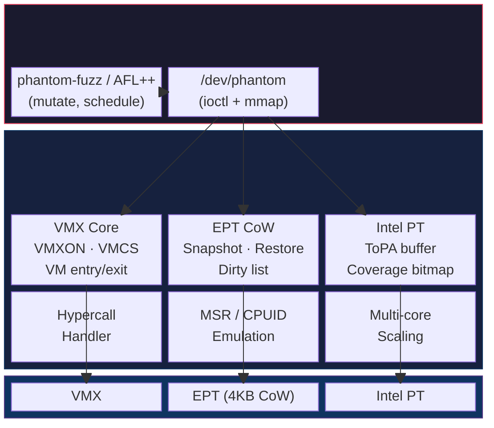
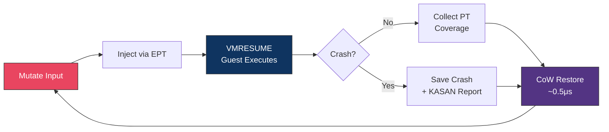

# Phantom

**A bare-metal hypervisor fuzzer built as a Linux kernel module.**

Phantom takes exclusive VMX-root ownership on dedicated Intel hardware, replacing the KVM + QEMU stack with a minimal micro-hypervisor purpose-built for coverage-guided fuzzing. The result is significantly higher throughput than existing hypervisor-based fuzzers while retaining compatibility with standard AFL++/kAFL frontends.

> **Status: Research Prototype — Not Production Ready**
>
> Phantom is under active development. APIs, module interfaces, and internal
> architecture may change without notice. It has been tested on a single
> hardware configuration (Intel i7-6700) and is not yet suitable for
> general deployment. Use at your own risk.

---

## Performance

Benchmarked on Intel i7-6700, bare metal, single core, Linux 6.8.0, 30-run median:

| Metric | Phantom | kAFL/Nyx (published) | Speedup |
|--------|---------|---------------------|---------|
| Exec/sec (Class B kernel target) | **85,000 – 90,000** | 10,000 – 20,000 | **4.4x – 8.8x** |
| Snapshot restore latency | **~0.5μs** (1,700 cycles) | 100 – 500μs | **200x – 1000x** |
| Input injection latency | **<1μs** (EPT direct write) | ~5μs (KVM+QEMU hypercall) | **5x+** |
| Memory per instance | **50 – 200MB** | 200MB – 1GB | **2x – 5x** |

### nf_tables Campaign Results (COS 6.12.68 + KASAN)

| Metric | Value |
|--------|-------|
| Sustained exec/sec | 22,472 |
| Total iterations (1 hour) | 80.8M |
| Coverage edges | 63,913 |
| New coverage paths discovered | 21,969 |

> **Note:** The 22k exec/s nf_tables figure is lower than the 85k headline because KASAN instrumentation adds 3–5x overhead and the nf_tables batch transaction path is deeper than the minimal benchmark target. Without KASAN, nf_tables reaches ~85k exec/s.

---

## How Phantom Differs from Existing Tools

### vs kAFL / Nyx

kAFL and Nyx are the current state-of-the-art for hypervisor-based kernel fuzzing. They run guests inside KVM+QEMU, using KVM's dirty page tracking and QEMU's device emulation. Phantom eliminates both layers:

| | kAFL/Nyx | Phantom |
|---|---------|---------|
| **Hypervisor** | KVM (general-purpose) | Custom micro-hypervisor (fuzzing-only) |
| **Device emulation** | QEMU (full device model) | None (serial port only) |
| **Snapshot mechanism** | KVM dirty page log + QEMU state save | EPT Copy-on-Write with dirty list |
| **Restore path** | Userspace → kernel → KVM ioctl | In-kernel dirty list walk (no userspace round-trip) |
| **Coverage** | Intel PT (same) | Intel PT (same) |
| **VM exit overhead** | KVM dispatch + QEMU fallback | Direct function call in kernel module |

The key architectural difference is **EPT Copy-on-Write snapshot restore**. At snapshot time, Phantom marks all guest EPT pages read-only. Guest writes trigger EPT violations handled by a CoW fault handler that allocates private copies. On restore, only the dirty pages are reset — a tight loop over a small list, entirely in kernel space. This eliminates the KVM→QEMU→userspace round-trip that dominates kAFL/Nyx restore latency.

### vs syzkaller

syzkaller is a syscall fuzzer that generates programs (sequences of syscalls) and runs them in QEMU VMs. It is structure-aware and has found hundreds of kernel bugs. Phantom is complementary:

| | syzkaller | Phantom |
|---|-----------|---------|
| **Approach** | Grammar-based syscall generation | Coverage-guided mutation of raw messages |
| **Speed** | ~hundreds exec/s (per target subsystem) | 22,000+ exec/s (nf_tables with KASAN) |
| **State reset** | Full VM reboot or checkpoint | EPT CoW snapshot (~0.5μs) |
| **Determinism** | Non-deterministic (OS scheduling) | Fully deterministic (1000/1000 identical traces) |
| **Strengths** | Deep semantic understanding of syscall APIs | Raw speed, deterministic replay, rare path exploration |

Phantom's speed advantage comes from not needing to boot a VM or even reset full kernel state — only the pages that actually changed are restored.

### vs AFL++ (userspace fuzzing)

AFL++ is the standard for userspace fuzzing. Phantom extends the same mutation engine to kernel targets:

| | AFL++ (userspace) | Phantom (kernel targets) |
|---|-------------------|-------------------------|
| **Target** | Userspace binaries | Kernel subsystems (in-guest) |
| **Isolation** | Process fork/exec | Hardware VM (EPT isolation) |
| **Coverage** | Compile-time instrumentation or QEMU mode | Intel PT (no recompilation needed) |
| **Crash detection** | ASAN/signals | KASAN (in-guest) + EPT violation traps |

---

## Architecture



### Fuzzing Loop



### Guest Classes

| Class | Description | Use Case | Memory |
|-------|-------------|----------|--------|
| **A** | Bare-metal ELF (no OS) | Parser/library fuzzing | 16MB |
| **B** | Minimal Linux kernel | Kernel subsystem fuzzing | 256MB |

---

## Current Capabilities

- **EPT Copy-on-Write snapshot/restore** — sub-microsecond iteration reset
- **Intel PT coverage** — hardware-traced edge coverage, no guest recompilation
- **Multi-core fuzzing** — parallel instances on dedicated physical cores
- **Determinism** — 1000/1000 identical PT traces for identical input (verified)
- **KASAN integration** — guest kernel built with KASAN detects UAF, double-free, heap-overflow
- **Batched netlink harness** — multi-message sequences for nf_tables batch transaction fuzzing
- **nyx_api ABI compatibility** — works with kAFL/Nyx guest harnesses
- **Crash deduplication** — coverage bitmap hashing to deduplicate crash reports

---

## Quick Start

### Requirements

- Intel CPU with VT-x, EPT, and Intel PT support
- Dedicated physical cores (Phantom takes exclusive VMX-root ownership)
- Linux 6.8+ host kernel
- `kvm_intel` must be unloaded before loading `phantom.ko`

### Build

```bash
# Build kernel module
make -C kernel/

# Build userspace fuzzer
make -C userspace/phantom-fuzz/
```

### Run (nf_tables example)

```bash
# Generate seed corpus
cd guest/guest_kernel/seeds && python3 gen_nft_seeds.py && cd -

# Load module (single core)
sudo rmmod kvm_intel 2>/dev/null
sudo insmod kernel/phantom.ko phantom_cores=0

# Fuzz nf_tables on COS 6.12.68 kernel with KASAN
sudo userspace/phantom-fuzz/phantom-fuzz \
    --bzimage /path/to/cos-bzImage \
    --seeds guest/guest_kernel/seeds/seeds/ \
    --duration 3600 \
    --output /tmp/nft-campaign
```

### Benchmark

```bash
sudo bash benchmarks/reproduce.sh --cores 1 --runs 30
```

---

## Repository Structure

```
kernel/                     Linux kernel module (phantom.ko)
  phantom_main.c              Module init/cleanup, chardev
  vmx_core.c                  VMXON/VMXOFF, VMCS, VM entry/exit loop
  ept.c                       EPT page table construction
  ept_cow.c                   CoW fault handler, dirty list, page pool
  snapshot.c                  VMCS save/restore, XSAVE/XRSTOR
  pt_config.c                 Intel PT MSR + ToPA setup
  hypercall.c                 nyx_api ABI hypercall dispatch
  guest_boot.c                Class B Linux guest boot (bzImage loader)
  multicore.c                 Multi-core orchestration
  nmi.c                       NMI-exiting, watchdog mitigation
  msr_emul.c / cpuid_emul.c   MSR and CPUID emulation
  interface.c                 /dev/phantom chardev, ioctl dispatch
  debug.c                     VMCS dump, EPT walker, diagnostics
userspace/
  phantom-fuzz/               Standalone fuzzer (mutation + scheduling)
  phantom-pt-decode/          Intel PT trace → AFL edge bitmap
  afl-phantom/                AFL++ custom mutator bridge
guest/
  guest_kernel/               Guest kernel harnesses + seed generators
benchmarks/                   30-run benchmark suite + analysis scripts
phases/                       Development task specifications
docs/                         Design documents
```

---

## Limitations

This is a research prototype with known limitations:

- **Single hardware configuration tested** — Intel i7-6700 only. Other Intel CPUs with VT-x/EPT/PT should work but are untested.
- **No device emulation** — guests have no disk, network, or display. Only serial port (0x3f8) for console output.
- **No SMP guests** — guest kernels boot with `nosmp`. Single vCPU per instance.
- **No nested virtualization** — Phantom takes exclusive VMX-root. Cannot coexist with KVM.
- **Max 3 fuzzing cores on 4-core CPUs** — at least 1 core must remain for the host OS. Using all physical cores causes hard lockups.
- **Coverage bitmap saturation** — the 64KB edge bitmap saturates (~65k edges) on large kernel targets. Larger bitmaps are planned.
- **No Windows guest support** — Linux guests only.

---

## License

GPL-2.0-only — see [LICENSE](LICENSE).

---

## Acknowledgments

Phantom builds on ideas from:

- [kAFL](https://github.com/IntelLabs/kAFL) — Intel PT-guided kernel fuzzing architecture
- [Nyx](https://nyx-fuzz.com/) — fast snapshot fuzzing via KVM
- [AFL++](https://github.com/AFLplusplus/AFLplusplus) — mutation engine and coverage bitmap design
- [syzkaller](https://github.com/google/syzkaller) — kernel fuzzing corpus and target identification
